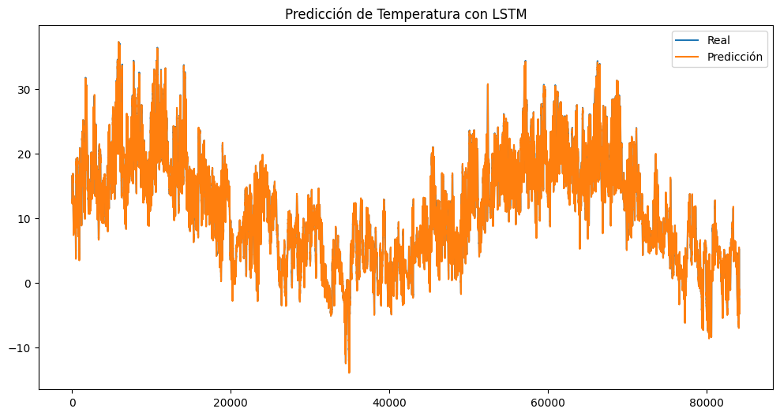

# DCD_Deep-Learning-
Proyecto 1 para el Diplomado en Ciencia de Datos BUAP
---
Este proyecto utiliza una red neuronal LSTM  para predecir la temperatura en la ciudad de Jena, Alemania, utilizando datos históricos climáticos recopilados entre 2009 y 2016. Se desarrolla un modelo de Deep Learning capaz de predecir la temperatura futura a partir de una secuencia de datos anteriores, usando redes neuronales recurrentes (RNN), específicamente LSTM. Se eligió una red LSTM debido a su capacidad para manejar secuencias temporales y conservar información relevante a largo plazo, lo cual es fundamental en predicciones de clima.

---
Entrenamiento

- Épocas: 10
- Batch size: 64
- Validación en cada época para evitar overfitting.

---
 Resultados

Se realizó la predicción de la temperatura y se comparó contra los datos reales. El modelo logra capturar la tendencia general de los cambios de temperatura.

---
 Autora
Alejandra Penagos
Licenciatura en Física – Facultad de Ciencias Físico-Matemáticas
Proyecto para la asignatura de Deep Learning
Abril 2025

